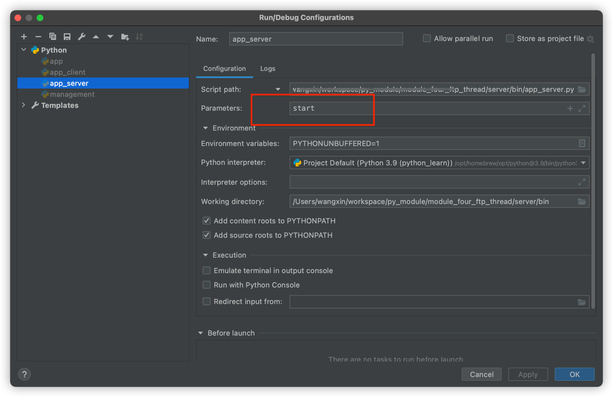
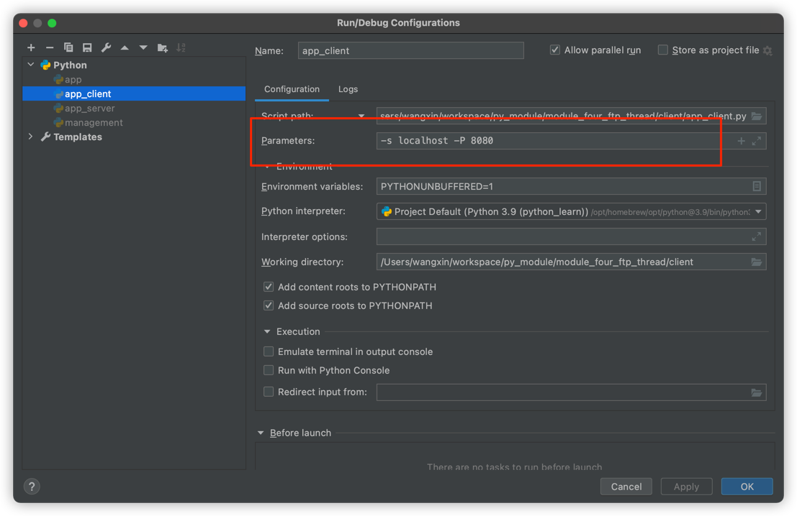
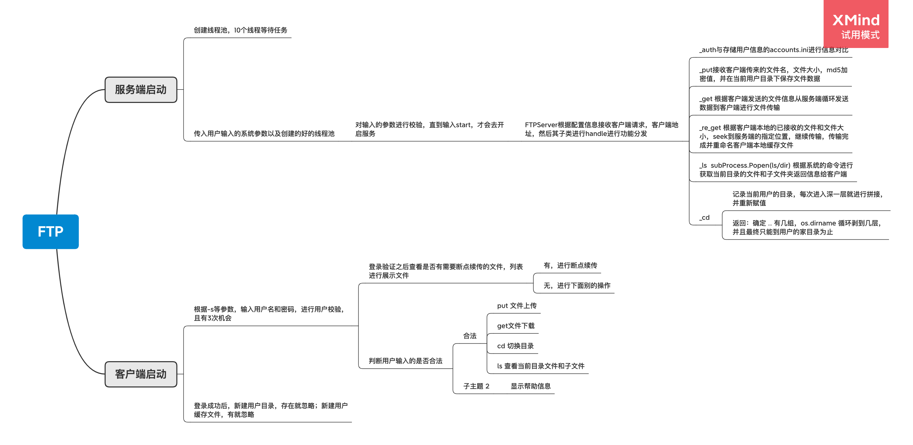

# FTP 多线程


## 服务端启动

```shell
python3  server/bin/app_server.py start
```

或者

pycharm运行一次`app_server.py`，然后点击右上角
edit configurations




## 客户端启动

pycharm的运行方式



下面是命令行的
```shell
python client/app_client.py -s localhost -P 8080

python3 client/app_client.py -s 127.0.0.1 -P 8080
```


## 用户信息

```ini
[alex]
name = alex
password = e10adc3949ba59abbe56e057f20f883e

[wx]
name=wx
password = e10adc3949ba59abbe56e057f20f883e

[evil]
name=evil
password=e10adc3949ba59abbe56e057f20f883e

[egon]
name = egon
password = e10adc3949ba59abbe56e057f20f883e

[evan]
name=evan
password = e10adc3949ba59abbe56e057f20f883e
```

密码都是：123456


## flow_chart

